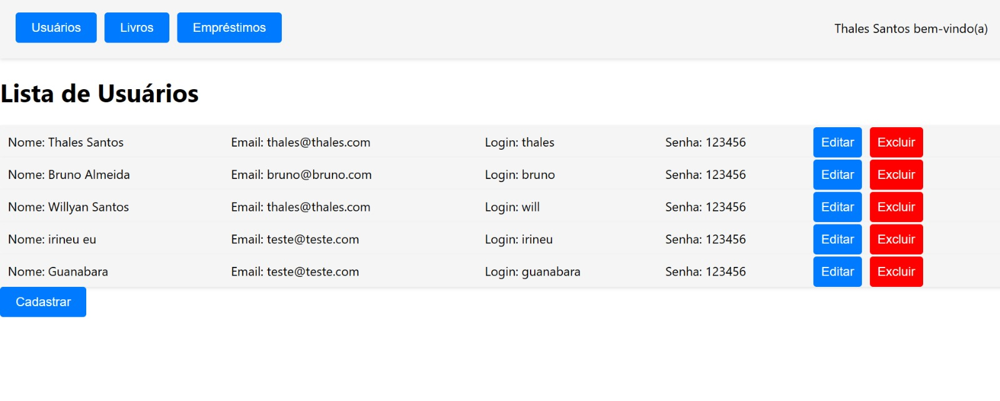
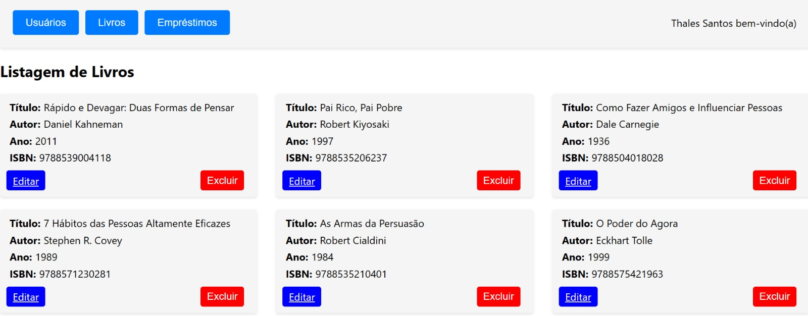

# Boas vindas ao repositório do Projeto da aula de Tópicos Especiais em Programação.

O projeto tem o objetivo de demonstrar as lições aprendidas nas aulas de Tópicos Especiais em Programação. Trata-se de uma API Rest de um sistema baseando num diagrama de classe especificado com utilização de Node.js e com banco MySQL.

<br />
  
<details>
<summary><strong>🧑‍💻 O que defoi desenvolvido:</strong></summary><br />

Uma API Rest onde os usuários podem visualizar e gerenciar informações sobre usuários e livros. Ela utiliza tecnologias como React, React Router e Axios no lado do cliente, e Sequelize e MySQL no lado do servidor.

<br />

Aplicação rodando tem a seguinte aparência:




<br />

</details>
  


<details>
<summary><strong>🛠 Execução e Testes</strong></summary><br />

Após clonar o reposítorio:
<br />
```git clone git@github.com:thalesorm/class-project-advanced-programming-topics.git```

Na pasta raiz, instale as dependências no lado servidor rodando no terminal o comando:
```npm install```

Em seguida, acesse o diretório frontBiblioteca e instale as depencencias no lado cliente com o comando:
```npm install```

Para executar em seu navegador é necessário fazer as configurações necessárias com o banco de dados e em seguida, na raiz do projeto e dentro do diretório frontBiblioteca o seguinte comando:
```npm start```

*Lembrando que você precisa ter o node instalado em sua máquina!


</details>

<br />

<details>
  <summary><strong> 🗓 Autor: Thales Santos</strong></summary><br />

Este projeto foi desenvolvido por Thales Santos, estudante do 9º período do curso de Engenharia da Computação no Centro Universitário Mário Pontes Jucá. A aplicação é uma biblioteca online, criada com o objetivo de permitir o gerenciamento de usuários e a exibição de informações sobre livros. Através dela, os usuários podem visualizar, cadastrar, editar e excluir usuários, além de acessar uma lista de livros disponíveis. O projeto utiliza tecnologias como React, React Router, Axios, Sequelize e MySQL para a implementação das funcionalidades no lado do cliente e do servidor.

</details>
  
